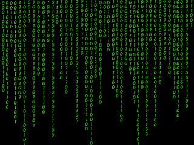

# RSA
Algoritmo RSA en python usando tkinter

## 🔐 Implementación del Algoritmo RSA

### 📝 Descripción
Una implementación simple del algoritmo de cifrado RSA con interfaz gráfica usando Python y Tkinter.

### ✨ Características
* 🔑 Generación de claves públicas y privadas
* 📨 Cifrado de mensajes
* 📩 Descifrado de mensajes
* 🖥️ Interfaz gráfica intuitiva

### 👨‍💻 Autor
Desarrollado como complemento para la clase de Criptografía

